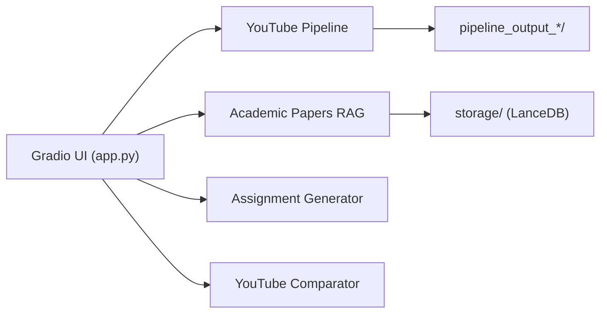
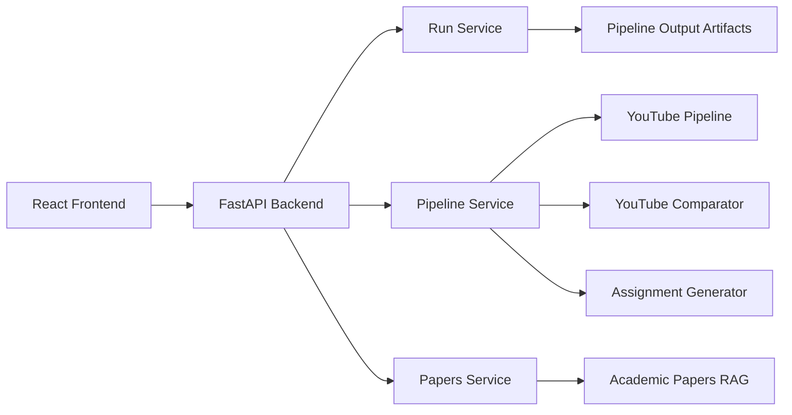

# Shinu Learn Engine

> **An AI-powered Learning Intelligence Platform** that transforms YouTube and academic content into structured knowledge, comparisons, and assignments.

[](LICENSE)
[](https://python.org)
[](https://gradio.app)
[](https://fastapi.tiangolo.com)
[](https://react.dev)
[](https://github.com/ShinuAILabs)

---

## Introduction

**Shinu Learn Engine** is a full-stack Learning Intelligence Platform that turns raw video and academic paper content into structured, actionable learning outputs.

It orchestrates an end-to-end AI pipeline — from natural-language YouTube search through transcript extraction, AI summarization, multi-video comparison, and assignment generation — and pairs it with a semantic academic papers RAG engine backed by LanceDB.

Unlike simple chatbots or standalone summarizers, Shinu Learn Engine is architected as a **production-grade learning workflow system**, built for technical learners, researchers, and educators who need reliable, structured knowledge — not just raw text.

**Key capabilities at a glance:**

- 🎥 **YouTube Intelligence Pipeline** — search → fetch → transcribe → summarize → compare → assign
- 📄 **Academic Research RAG** — query indexed PDFs with natural language, get cited answers
- 🗂️ **Structured Learning Outputs** — summaries, comparison tables, and assignments as persistent artifacts
- 🖥️ **Modern Dashboard** — React + TypeScript interface with real-time pipeline status and clickable video sources
- 🛡️ **Resilient Pipeline** — Fallback transcript fetching and intelligent API retry logic to handle rate limits

---

## Who Is This For?

| Audience | Use Case |
|---|---|
| 🎓 **Students** | Quickly extract learning outcomes from multiple videos, generate assignments for self-assessment |
| 🧑‍💻 **Developers** | Research technical topics across video and paper sources, compare frameworks and tools |
| 🏫 **Educators** | Generate structured lesson content, assignments, and reading packs from curated resources |
| 🤖 **AI Engineers** | Explore the end-to-end pipeline architecture, extend modules, integrate into learning products |

---

## What It Does

### 🎥 YouTube Intelligence Pipeline

1. **Search** — Query YouTube using natural language; retrieve ranked video metadata
2. **Transcript Extraction** — Fetch subtitles and transcripts for selected videos
3. **AI Summarization** — Generate structured summaries focused on technical learning outcomes
4. **Multi-Video Comparison** — Interactive dashboard comparing videos across depth, difficulty, teaching style, and audience fit — with clickable thumbnails and titles for direct access
5. **Assignment Generation** — Produce educational assignments derived from analyzed content with interactive progress tracking

### 📄 Academic Research RAG

- Query indexed PDF documents using natural language
- Receive AI-generated responses with source citations and relevant excerpts
- Powered by **LlamaIndex** + **LanceDB** for fast, accurate semantic retrieval

### 🗂️ Structured Learning Outputs

- Artifacts are persisted per pipeline run under timestamped output directories
- Every stage — search results, transcripts, summaries, comparisons, assignments — is stored as structured JSON or Markdown
- Outputs are accessible through both the Gradio UI and the REST API

---

## Why Shinu Learn Engine?

Most learning tools stop at summarization. **Shinu Learn Engine** goes further:

| Capability | What It Means |
|---|---|
| **End-to-end pipeline** | One query drives the entire journey: search → transcript → summary → comparison → assignment |
| **Video + Research fusion** | Combines YouTube video intelligence with academic paper RAG in a single platform |
| **Structured outputs** | Every result is a persistent, browseable artifact — not a one-off chat response |
| **Learning-first design** | Every pipeline stage is designed around technical learning and research workflows |
| **Extensible architecture** | Clean service layer makes it straightforward to add new data sources or output formats |

---

## Example Output

### 📋 Sample Summary (Bullet Points)

> **Topic:** Transformer Architecture Explained
>
> - Introduces the attention mechanism as the core replacement for recurrence
> - Covers multi-head self-attention, positional encoding, and feed-forward sublayers
> - Difficulty: Intermediate — assumes familiarity with sequence models
> - Best for: engineers transitioning from RNNs to Transformers
> - Key takeaway: attention weights allow the model to focus on relevant tokens regardless of distance

---

### 📊 Comparison Table Features

The comparison table is a fully interactive HTML table rendered in the Gradio UI:

| Column | Details |
|---|---|
| **🎬 Video** | YouTube thumbnail — click to open the video in a new tab |
| **📺 Title** | Clickable link — opens the video on YouTube in a new tab |
| **Difficulty** | Colour-coded badge: 🟢 Beginner · 🟡 Intermediate · 🔴 Advanced |
| **Teaching Style** | Badge: Code-along · Explanation-heavy · Project-based · Theory-focused · Mixed |
| **Content Depth** | Badge: Surface-level · Moderate · Deep-dive |
| **Status Feedback**| Explicit "Generation Failed" alerts with troubleshooting tips for rate-limited scenarios |

> **Note:** Difficulty, Teaching Style, and Content Depth are generated by the AI insight engine and require successful AI summarization. The pipeline now includes a **secondary transcript fetcher** (`youtube-transcript-api`) and **exponential backoff retries** to maximize success rates.

---

### 📋 Sample Summary

> **Topic:** Transformer Architecture Explained
>
> - Introduces the attention mechanism as the core replacement for recurrence
> - Covers multi-head self-attention, positional encoding, and feed-forward sublayers
> - Difficulty: Intermediate — assumes familiarity with sequence models
> - Best for: engineers transitioning from RNNs to Transformers
> - Key takeaway: attention weights allow the model to focus on relevant tokens regardless of distance

---

### 📝 Sample Assignment

> **Assignment: Understanding Self-Attention**
>
> 1. Explain in your own words why positional encoding is necessary in the Transformer architecture.
> 2. Implement a single-head scaled dot-product attention function in Python using NumPy.
> 3. Compare the computational complexity of self-attention vs. an LSTM for a sequence of length *n*.
> 4. **Challenge:** Modify your implementation to support a causal (autoregressive) attention mask.

---

## Tech Stack

### Primary UI — Gradio App (`app.py`)

| Technology | Role |
|---|---|
| `Gradio 6.x` | Web interface framework (single-file, no build step) |
| `python-dotenv` | `.env` based API key configuration |
| `LlamaIndex` | Indexing and querying academic PDF documents |
| `LanceDB` | Vector store for semantic paper retrieval |
| Core pipeline modules in `src/` | YouTube pipeline, comparison, assignment, RAG |

### Optional REST API — FastAPI Backend (`backend/`)

| Technology | Role |
|---|---|
| `FastAPI` | REST API layer and async request handling |
| `Pydantic` | Request/response schema validation |

### Optional React Frontend (`frontend/`)

| Technology | Role |
|---|---|
| `React 18` | UI component framework |
| `TypeScript` | Type-safe application logic |
| `Vite` | Development server and production bundler |
| `Tailwind CSS` | Utility-first styling |
| `TanStack Query` | Server state management and caching |
| `Framer Motion` | Animations and transitions |

---

## Architecture

Shinu Learn Engine supports **two UI modes** that share the same core Python pipeline modules:

### Mode 1 — Gradio UI (Primary, `app.py`)

A single Python file launches the full web interface via Gradio. No separate frontend build or API server is needed.



### Mode 2 — React + FastAPI UI (Optional, `frontend/` + `backend/`)

A typed REST API (FastAPI) serves a React client. Core domain logic is the same pipeline modules from `src/`.



---

## Project Structure

```text
shinu-learn-engine/
├── backend/                        # FastAPI application
│   ├── main.py                     # App entrypoint and router registration
│   ├── routers/
│   │   ├── runs.py                 # Run metadata and artifact endpoints
│   │   ├── pipeline.py             # Pipeline execution endpoints
│   │   └── papers.py              # Academic papers query endpoints
│   ├── schemas/                    # Pydantic request/response models
│   └── services/
│       ├── run_service.py
│       ├── pipeline_service.py
│       ├── papers_service.py
│       └── artifact_readers.py
│
├── frontend/                       # React + Vite frontend
│   ├── src/
│   │   ├── App.tsx
│   │   ├── features/
│   │   │   ├── pipeline/           # Pipeline dashboard views
│   │   │   └── papers/            # Academic papers panel
│   │   └── lib/
│   │       ├── api.ts              # API client
│   │       └── types.ts            # Shared TypeScript types
│   ├── package.json
│   └── vite.config.ts
│
├── src/                            # Python domain pipeline modules
│   ├── youtube_pipeline.py
│   ├── compare_youtube_outputs.py
│   ├── assignment_generator.py
│   ├── papers_rag.py
│   ├── fetch_youtube_transcript.py
│   ├── summarize_youtube_transcript.py
│   └── configs/
│       └── config.yaml
│
├── papers/agents/                  # Source academic PDF documents
├── pipeline_output_*/              # Timestamped YouTube pipeline artifacts
├── storage/                        # Indexed paper storage (LanceDB)
│   ├── papers_index/
│   └── papers_vectordb/
├── requirements.txt
└── README.md
```

---

## Setup Instructions

### Prerequisites

| Requirement | Notes |
|---|---|
| **Python 3.10+** | Use `venv` (recommended) or `conda` for environment management |
| **Node.js 18+** | Required only if using the optional React frontend |
| **npm** | Bundled with Node.js |
| **OpenRouter API key** | LLM access for summarization, comparison, and assignment generation |
| **YouTube Data API key** | YouTube search; **OAuth is NOT needed** for basic video search |

---

### Step 1 — Clone the Repository

```bash
git clone https://github.com/ShinuAILabs/shinu-learn-engine
cd shinu-learn-engine
```

---

### Step 2 — Set Up the Python Environment

**Using `venv` (recommended on Windows):**

```bash
python -m venv .venv
# Activate on Windows PowerShell:
.venv\Scripts\Activate.ps1
# Activate on Linux/macOS:
source .venv/bin/activate
```

**Using `conda`:**

```bash
conda create -n shinu-learn-engine python=3.10 -y
conda activate shinu-learn-engine
```

---

### Step 3 — Install Python Dependencies

```bash
pip install -r requirements.txt
```

---

### Step 4 — Configure Environment Variables

Create a `.env` file in the repository root:

```env
OPENROUTER_API_KEY=your_openrouter_api_key_here
YOUTUBE_API_KEY=your_youtube_data_api_key_here
```

> **Note:** The YouTube Data API key is used for video search only. No OAuth flow or user authentication is required.

---

## API Keys Required

### OpenRouter API Key

- Obtain from [openrouter.ai](https://openrouter.ai)
- Used by AI summarization, comparison, and assignment generation
- Set as `OPENROUTER_API_KEY` in your `.env`

### YouTube Data API Key

- Obtain from [Google Cloud Console](https://console.cloud.google.com) → Enable **YouTube Data API v3**
- Used for searching YouTube videos by natural language query
- **OAuth is NOT required** — a simple API key is sufficient
- Set as `YOUTUBE_API_KEY` in your `.env`

---

## Running the Project

### Option A — Gradio UI (Recommended, single command)

The Gradio interface runs everything in one command with no separate server or build step needed.

**On Windows (PowerShell):**

```powershell
$env:PYTHONUTF8='1'; $env:PYTHONUNBUFFERED='1'; .venv\Scripts\python.exe app.py
```

**On Linux / macOS:**

```bash
PYTHONUTF8=1 python app.py
```

Open the application:

```
http://127.0.0.1:7860
```

**Optional flags:**

| Flag | Description |
|---|---|
| `--port 8080` | Run on a custom port |
| `--share` | Create a temporary public Gradio link |
| `--demo` | Demo mode — uses cached pipeline output, no API keys required |
| `--debug` | Show detailed error tracebacks in the UI |

Example:

```bash
python app.py --demo --port 8080
```

> **Windows note:** Always set `PYTHONUTF8=1` before running. Without it, emoji characters in console output cause a `UnicodeEncodeError` on Windows cp1252 terminals.

---

### Option B — React + FastAPI UI (Advanced)

This mode requires running two separate processes.

**Start the FastAPI backend:**

```bash
uvicorn backend.main:app --reload --host 127.0.0.1 --port 8000
```

Verify:

```
http://127.0.0.1:8000/api/health
```

**Start the React frontend (second terminal):**

```bash
cd frontend
npm install   # first time only
npm run dev
```

Open:

```
http://127.0.0.1:5174
```

> The Vite dev server proxies all `/api` requests to the FastAPI backend via `frontend/vite.config.ts`. If port 5173 is in use, it will automatically try 5174.

---

### Frontend Production Build

```bash
cd frontend
npm run lint
npm run build
# Output: frontend/dist/
```

---

## API Overview

### Run & Artifact Endpoints

| Method | Endpoint | Description |
|---|---|---|
| `GET` | `/api/runs` | List all pipeline runs |
| `GET` | `/api/runs/latest` | Fetch the most recent run |
| `GET` | `/api/runs/{run_id}` | Get run metadata |
| `GET` | `/api/runs/{run_id}/videos` | List videos in a run |
| `GET` | `/api/runs/{run_id}/transcripts` | Fetch transcripts |
| `GET` | `/api/runs/{run_id}/summaries` | Fetch summaries |
| `GET` | `/api/runs/{run_id}/comparison` | Fetch comparison output |
| `GET` | `/api/runs/{run_id}/assignments` | Fetch generated assignments |

### Pipeline Execution Endpoints

| Method | Endpoint | Description |
|---|---|---|
| `POST` | `/api/pipeline/search` | Trigger a new YouTube search |
| `POST` | `/api/runs/{run_id}/transcripts` | Fetch transcripts for a run |
| `POST` | `/api/runs/{run_id}/summaries` | Generate summaries |
| `POST` | `/api/runs/{run_id}/comparison` | Generate comparison output |
| `POST` | `/api/runs/{run_id}/assignments` | Generate assignments |

### Academic Papers Endpoints

| Method | Endpoint | Description |
|---|---|---|
| `GET` | `/api/papers/status` | Check paper index status |
| `POST` | `/api/papers/query` | Submit a natural language query |

---

## Application Flow

### YouTube Workflow

```
User Query
    │
    ▼
POST /api/pipeline/search
    │
    ▼
Backend creates a new pipeline run (pipeline_output_<timestamp>/)
    │
    ▼
Video metadata served from run artifacts
    │
    ├──▶ POST transcripts → Transcript extraction + SRT files
    ├──▶ POST summaries   → AI-structured summaries (JSON)
    ├──▶ POST comparison  → Multi-video comparison table
    └──▶ POST assignments → Educational assignments (Markdown)
    │
    ▼
React frontend renders each stage as a structured, navigable view
```

### Academic Papers Workflow

```
User submits natural language question
    │
    ▼
POST /api/papers/query
    │
    ▼
FastAPI delegates to AcademicPapersRAG (LlamaIndex + LanceDB)
    │
    ▼
Response includes: answer text · citations · excerpts · timing metadata
```

---

## Configuration

Primary runtime configuration lives in `src/configs/config.yaml`.

Key settings include:

| Setting | Purpose |
|---|---|
| OpenRouter model selection | Choose the LLM used for generation |
| Worker counts & concurrency | Control parallel pipeline execution |
| Transcript language defaults | Set preferred subtitle languages |
| YouTube API settings | Configure search parameters |
| Prompt paths | Point to prompt templates |
| Output directory settings | Control artifact storage locations |

---

## Data & Storage

### YouTube Pipeline Artifacts

Each pipeline run writes files under `pipeline_output_<timestamp>/`:

```
pipeline_output_<timestamp>/
├── metadata/
│   ├── search_results_*.json
│   ├── fetch_results_*.json
│   └── summary_results_*.json
├── transcripts/
│   └── *.srt
├── summaries/
│   └── *_summary.json
└── assignments/
    └── *_assignment.md
```

### Academic Papers Storage

```
papers/agents/          ← Source PDF documents
storage/
├── papers_index/       ← LlamaIndex document index
└── papers_vectordb/    ← LanceDB vector store
```

---

## Roadmap

Planned features and enhancements for future releases:

- [ ] **AI Tutor Mode** — Interactive Q&A agent grounded in pipeline run artifacts
- [ ] **Semantic Search** — Search across all historical run artifacts and paper queries
- [ ] **Personalized Learning Paths** — Adaptive recommendations based on viewed content and quiz performance
- [ ] **Notion & Obsidian Integration** — Export summaries, comparisons, and assignments directly to note-taking tools
- [ ] **Multi-language Support** — Transcript processing and output generation in additional languages
- [ ] **Quiz Generation** — Auto-generate multiple-choice and short-answer quizzes from summaries
- [ ] **User Authentication** — Multi-user support with per-user run history

---

## Deployment

### Backend (FastAPI)

Deploy the FastAPI backend using any ASGI-compatible server or platform:

```bash
# Production startup with Gunicorn + Uvicorn workers
gunicorn backend.main:app -k uvicorn.workers.UvicornWorker --bind 0.0.0.0:8000
```

Recommended platforms: **Railway**, **Render**, **AWS ECS**, **GCP Cloud Run**

---

### Frontend (Vite → Static Build)

Build the production bundle and deploy as a static site:

```bash
cd frontend
npm run build
# Output: frontend/dist/
```

Recommended platforms: **Vercel**, **Netlify**, **Cloudflare Pages**

Set the environment variable `VITE_API_BASE_URL` to point to your deployed backend URL.

---

### Storage

| Data | Location | Notes |
|---|---|---|
| Pipeline run artifacts | `pipeline_output_*/` | Persist this directory on the server or mount a volume |
| Paper PDFs | `papers/agents/` | Add PDFs here before indexing |
| LanceDB vector store | `storage/papers_vectordb/` | Persist across deployments |
| LlamaIndex document index | `storage/papers_index/` | Rebuild by re-running the indexing step if lost |

---

## License

This project is licensed under the **MIT License**. See [`LICENSE`](LICENSE) for full details.

---

## Author

**Shinu Learn Engine** is built and maintained by **Shinu AI Labs**.

> Building AI-powered tools for the next generation of technical learners and researchers.